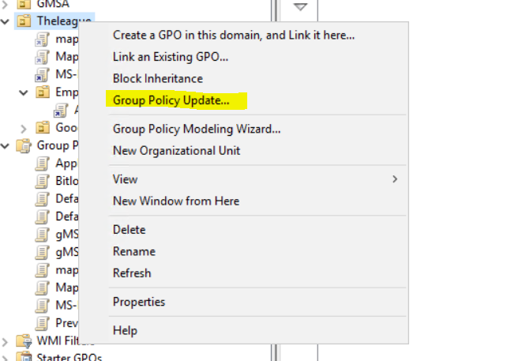
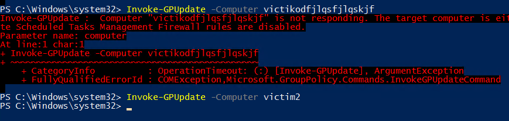
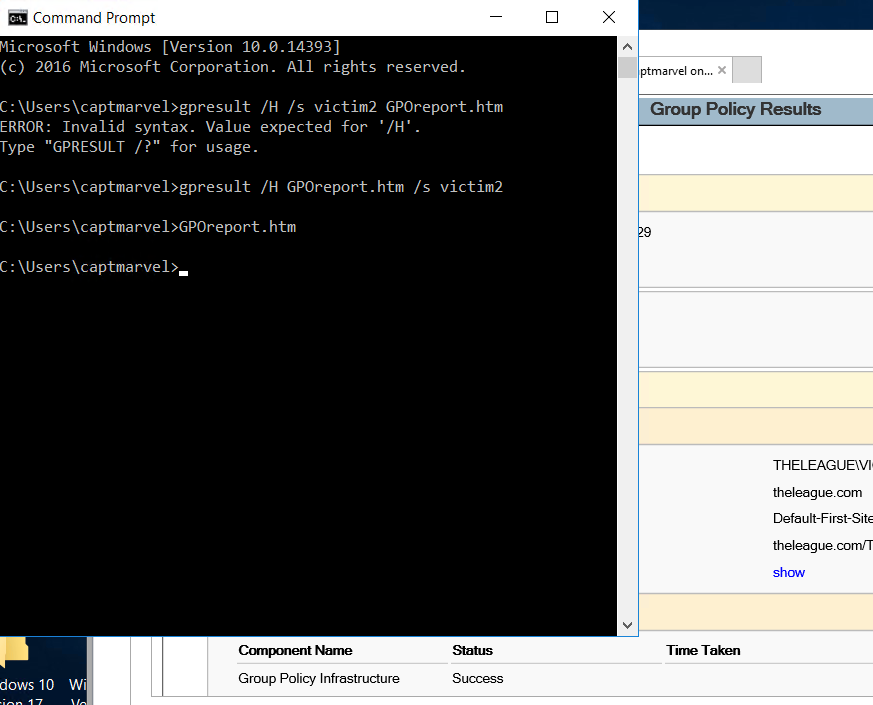
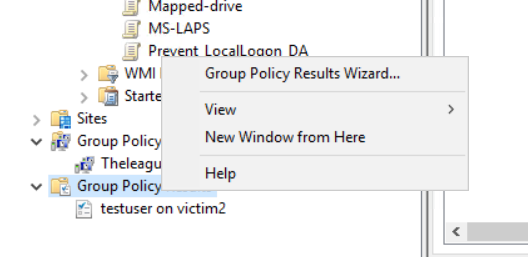
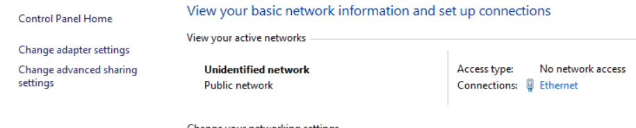

# Server-side

Als je toegang hebt tot de server, kan je makkelijk je gpo's verifiëren en ook een deel van de troubleshooting doen.

## GPUpdate

GPUpdate uitvoeren op de server doet maar 1 ding: de Group Policies die toegepast worden op de server refreshen. Dit heeft geen impact op de clients. Je kan wel vanop de server reeds een "gpupdate" op de clients forceren.

Of via [Powershell](https://docs.microsoft.com/en-us/powershell/module/grouppolicy/invoke-gpupdate?view=win10-ps). Hieronder heb ik tevens een niet-bestaande computername gebruikt om aan te tonen dat er wel degelijk feedback kan zijn want met "-verbose" of "-debug" laat hij niet veel zien.

### Opmerking bij gpupdate

Denk eraan dat als je een gpupdate uitvoert op een OU met heel veel users & computers in, deze allemaal je onmiddelijk je Domain Controller gaan bevragen. Het zou wel eens kunnen dat je hierdoor je eigen DC DDOS'ed.

Normaal gezien zijn er in productie niet veel situaties waarbij het updaten van een group policy een leven-of-dood situatie is en kan je gerust de interne 90-120 minuten timer zijn werk laten doen.

## GPResult

Net zoals bij gpupdate, toont gpresult het resultaat van de eigen computer. Je kan ook de target veranderen naar een remote computer door de "/s" parameter.

`gpresult /H "documentnaam".htm /s RemoteComputerNaam` 

Via de Group Policy Management Console echter kan je makkelijk ook een gpresult van een bepaalde user of computer opvragen.

Heel wat meer informatie over de Group Policy Results Wizard kan je  [hier](https://docs.microsoft.com/en-us/previous-versions/windows/it-pro/windows-server-2003/cc780305%28v=ws.10%29) terugvinden.

## Virtualisatie

Hou er ook rekening mee dat in labo-omgevingen je NIC wel eens graag op "public" springt en zodoende ook wel voor onverwachte perikelen kan zorgen.

